# vue_shop

## Project setup
```
npm install
```

### Compiles and hot-reloads for development
```
npm run serve
```

### Compiles and minifies for production
```
npm run build
```

### Run your tests
```
npm run test
```

### Lints and fixes files
```
npm run lint
```

### Customize configuration
See [Configuration Reference](https://cli.vuejs.org/config/).


## 项目介绍
### 登陆界面
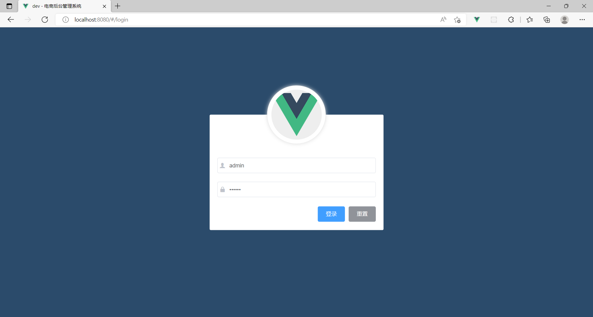
### 用户列表
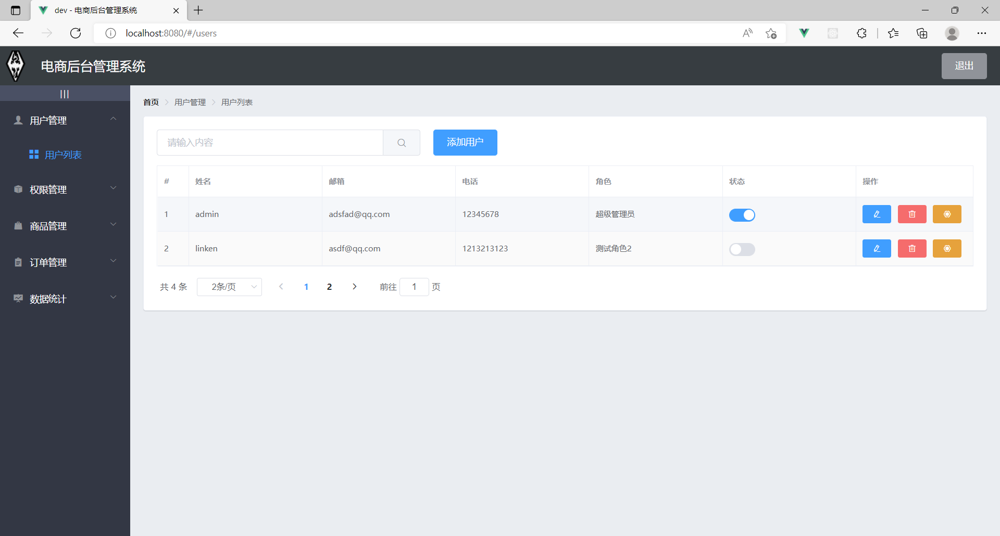
### 权限管理
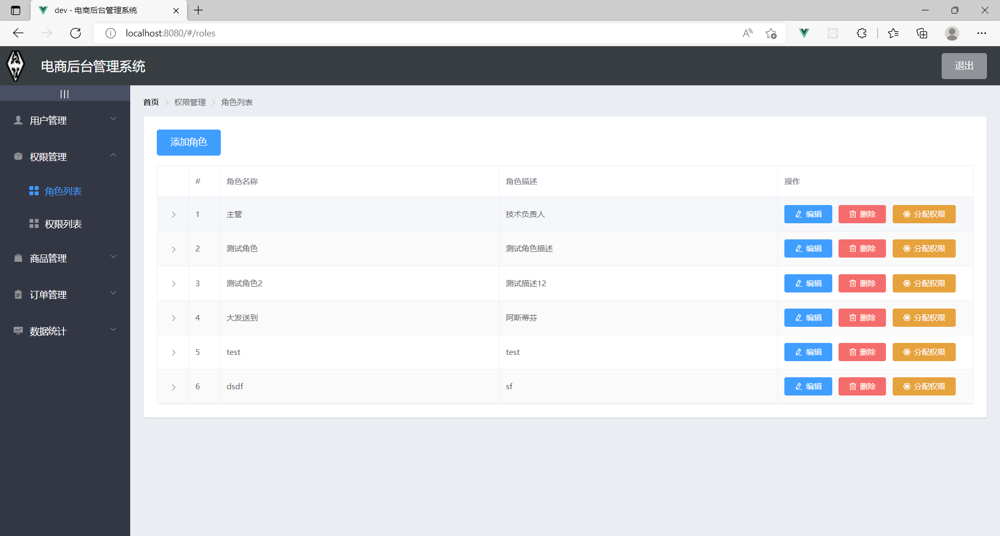
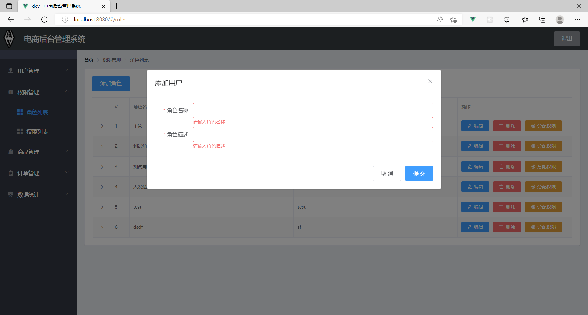
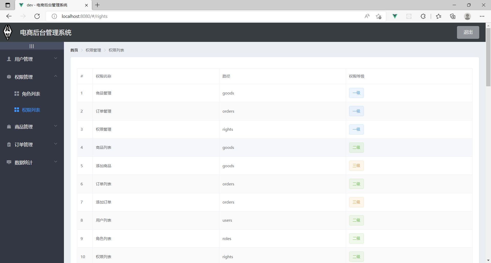
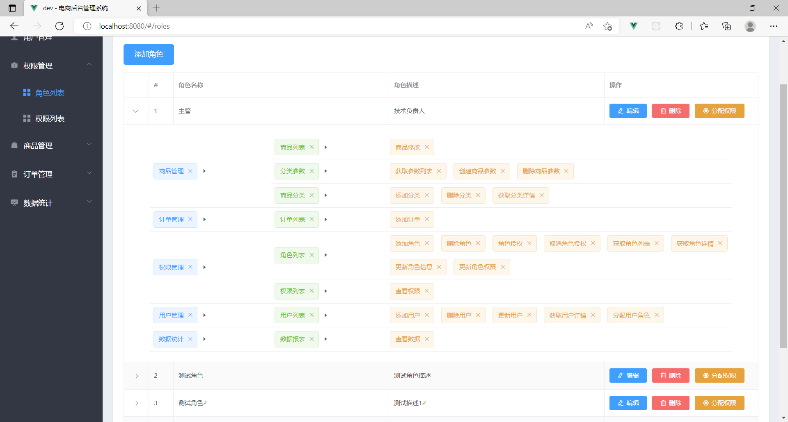
### 商品界面
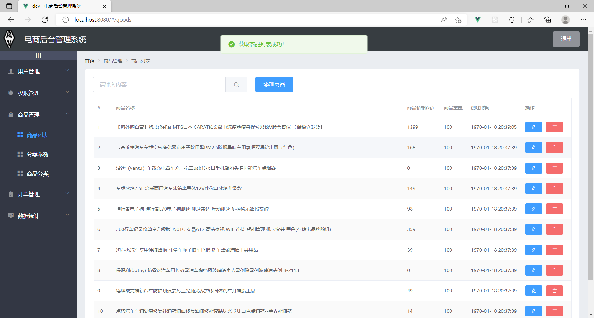
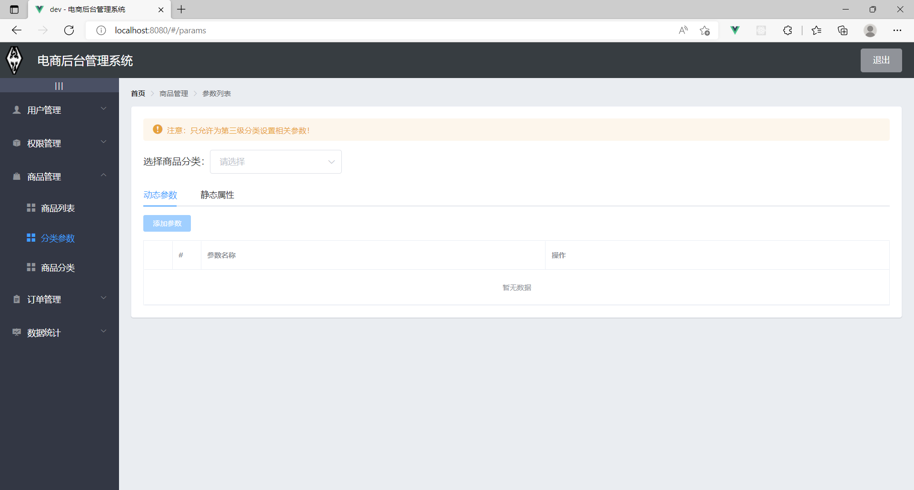
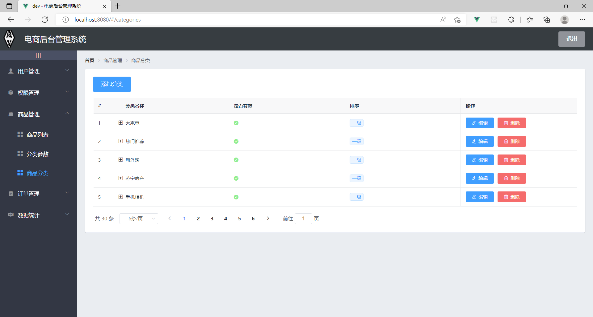
### 订单管理
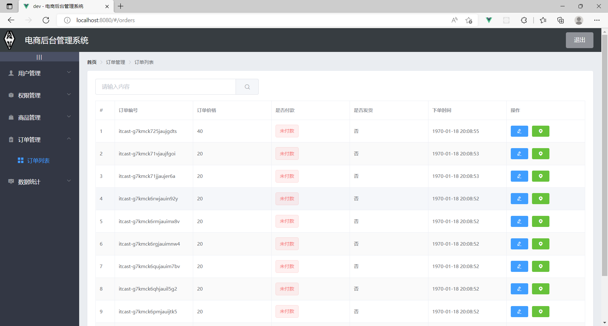
### 数据统计
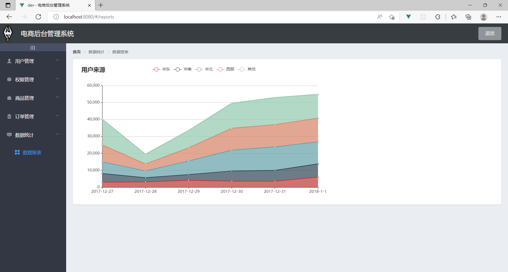